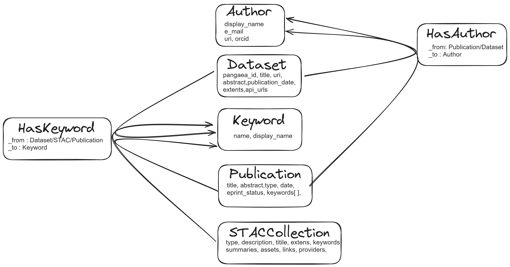

# Database Structure Overview



The main collections which we will be using are
 - Author
 - Dataset
 - Keyword
 - Publication
 - STACCollection
 - HasKeyword (Edge Collection)
 - HasAuthor (Edge Collection)
  
`Name of the Database` : ***cag-pangaea-rs-v2*** 

## Current Problems with the Database

### Not enough connections between the Dataset Collection and Keyword Collection  

The `HasKeyword` collection connects the `Dataset`/`STACCollection` collection to the `Keyword` collection. Out of ***2,998 doc(s)*** in `Dataset` collection, only ***264 doc(s)*** has a connection. This is a huge problem because more than 90% of the `Dataset` doc(s) does not have keywords. This results in word cloud being empty when a co-ordinate is selected from the Map chart.

```sql
LET Dataset_id_list = (
        FOR edge IN HasKeyword
            FILTER(CONTAINS(edge._from,'Dataset/'))
            RETURN edge._from
            )
            
RETURN COUNT(UNIQUE(Dataset_id_list)) //264
```
This query gives the number of Datasets which have a keyword connection.  

### Some doc(s) have null fields

This issue is mostly present in the extent(s) of both `Dataset` and `STACCollection`. The extent(s) include both temporal and spatial. When it comes to temporal, either start_date or end_date is `null`. When it comes to spatial, either the mean_latitude or mean_longitude is null.  