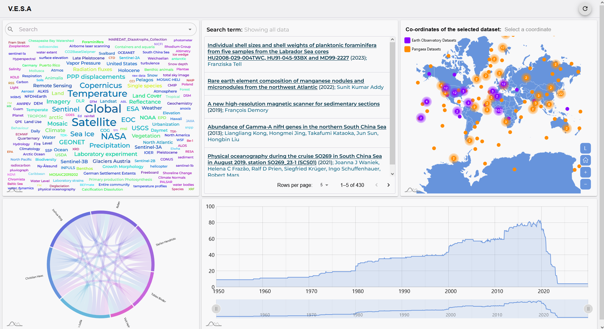

# VESA
Visualization Enabled Search Application
<p align="center"> 
   
</p>

Repository for the Visualisation Enabled Search Application (VESA). It is a visual exploration and search tool that assists users in navigating through a graph in an intuitive way. Different visualizations help in finding information across different dimensions. For example:

- **Map** → Spatial Context
- **Line Charts** → Temporal Context
- **Network Diagrams or Graphs** → Interrelations
- **Word Cloud** → Thematic Context

These dimensions provide various contexts, such as dataset locations (Map), measurement data (Temporal Charts), and word clouds to show different thematic contexts of datasets.

## 🛠 Setting Up the Local Development Environment

This section provides a detailed guide on how to set up the VESA project for local development, including setting up ArangoDB, restoring the database dump, and configuring and running the backend and frontend components.

### 1. Prerequisites

Before starting, ensure you have the following software installed on your machine:

- [Node.js](https://nodejs.org/) (v14 or above recommended)
- [npm](https://www.npmjs.com/) (comes with Node.js)
- [ArangoDB](https://www.arangodb.com/download-major/)

### 2. Setting Up ArangoDB

VESA uses ArangoDB as its database. Follow these steps to set up ArangoDB:

1. **Download and Install ArangoDB**:
   - Visit the [ArangoDB Download Page](https://www.arangodb.com/download-major/) and download the appropriate version for your operating system.
   - Follow the installation instructions provided on the website for your OS.

2. **Start the ArangoDB Server**:
   - After installation, start the ArangoDB server. You can usually start it from the command line or through the service management tools provided by your OS.
   - By default, ArangoDB will run on `http://127.0.0.1:8529/`.

3. **Access the ArangoDB Web Interface**:
   - Open a web browser and go to `http://127.0.0.1:8529/` to access the ArangoDB web interface.
   - Log in using the default credentials (`username: root`, `password: root`). You can change these credentials if necessary.

4. **Restoring the Database Dump**:
   - In the VESA repository, there is a directory named `DB` containing the file `arango-dump.zip`.
   - Unzip the `arango-dump.zip` file:

     ```bash
     unzip DB/arango-dump.zip -d DB/arango-dump/
     ```

   - Use the ArangoDB `arangorestore` command to restore the database:

     ```bash
     arangorestore --server.endpoint http+tcp://127.0.0.1:8529 --server.database <database-name> --server.username root --server.password root --input-directory DB/arango-dump/
     ```

     Replace `<database-name>` with the name you want for your database.

### 3. Setting Up the Backend

The backend is built using Node.js and connects to the ArangoDB database.

1. **Navigate to the Backend Directory**:

    ```bash
    cd BACKEND
    ```

2. **Install Dependencies**:

    ```bash
    npm install
    ```

3. **Create the `.env` File**:
   - The backend requires environment variables to be configured. You can use the `.env.template` file as a starting point.
   - Copy the `.env.template` file to create a `.env` file:

     ```bash
     cp .env.template .env
     ```

   - Open the `.env` file in a text editor and set the values for `ARANGO_URL`, `ARANGO_USER`, and `ARANGO_PASS`:

     ```env
     ARANGO_URL=http://127.0.0.1:8529/
     ARANGO_USER=root
     ARANGO_PASS=root
     ```

4. **Run the Backend**:

    ```bash
    npm run dev
    ```

    This command will start the backend server in development mode. The server will automatically reload if you make any changes to the source files.

### 4. Setting Up the Frontend

The frontend is built using React.js and communicates with the backend to fetch data and display it through various visualizations.

1. **Navigate to the Frontend Directory**:

    ```bash
    cd ../FRONTEND
    ```

2. **Install Dependencies**:

    ```bash
    npm install
    ```

3. **Create the `.env` File**:
   - The frontend also requires some environment variables, particularly the API URL.
   - Copy the `.env.template` file to create a `.env` file:

     ```bash
     cp .env.template .env
     ```

   - Open the `.env` file in a text editor and set the value for `REACT_APP_API_URL`:

     ```env
     REACT_APP_API_URL=http://127.0.0.1:3001
     ```

   - Ensure this URL points to where your backend is running.

4. **Run the Frontend**:

    ```bash
    npm start
    ```

    This command will start the frontend development server. It will be accessible in your web browser at `http://localhost:3000/` by default.

### 5. Final Steps

Now that both the backend and frontend are running, you can interact with the VESA application by navigating to `http://localhost:3000/` in your web browser.

- **Backend** runs on port `3001` (or the port specified in your `.env` file).
- **Frontend** runs on port `3000`.

Ensure that both components are communicating correctly by verifying that the frontend is successfully retrieving and displaying data from the backend.

### 6. Troubleshooting

If you encounter any issues during setup:

- **ArangoDB**: Check the [official documentation](https://www.arangodb.com/docs/stable/) for troubleshooting common problems.
- **Node.js/NPM**: Ensure you are using the correct versions by running `node -v` and `npm -v`.
- **Logs**: Check the terminal/console logs for any error messages and refer to the error documentation.
